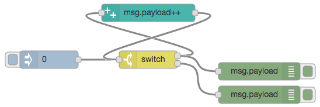

# node-red-contrib-increment

## Released

|Date|Version|Description|
|:--:|:-----:|:----------|
|2017-09-19|0.0.1|Released|

## Feature

* Can only increment.
* Increment any property of message object.

## Install

```bash
npm install --save node-red-contrib-increment
```

## Usage

Just put it.

## Example Flow



```json
[
    {
        "id": "64d1a21f.46796c",
        "type": "increment",
        "z": "3b5b5291.aa56ae",
        "name": "",
        "target": "payload",
        "x": 500,
        "y": 140,
        "wires": [
            [
                "25c86ea0.5c9952"
            ]
        ]
    },
    {
        "id": "cf9930a2.5cf0e",
        "type": "inject",
        "z": "3b5b5291.aa56ae",
        "name": "",
        "topic": "",
        "payload": "0",
        "payloadType": "num",
        "repeat": "",
        "crontab": "",
        "once": false,
        "x": 330,
        "y": 220,
        "wires": [
            [
                "25c86ea0.5c9952"
            ]
        ]
    },
    {
        "id": "1909252f.83cefb",
        "type": "debug",
        "z": "3b5b5291.aa56ae",
        "name": "",
        "active": true,
        "console": "false",
        "complete": "false",
        "x": 690,
        "y": 240,
        "wires": []
    },
    {
        "id": "25c86ea0.5c9952",
        "type": "switch",
        "z": "3b5b5291.aa56ae",
        "name": "",
        "property": "payload",
        "propertyType": "msg",
        "rules": [
            {
                "t": "lt",
                "v": "20",
                "vt": "str"
            },
            {
                "t": "else"
            }
        ],
        "checkall": "true",
        "outputs": 2,
        "x": 500,
        "y": 220,
        "wires": [
            [
                "64d1a21f.46796c",
                "1909252f.83cefb"
            ],
            [
                "aaacbb02.dab158"
            ]
        ]
    },
    {
        "id": "aaacbb02.dab158",
        "type": "debug",
        "z": "3b5b5291.aa56ae",
        "name": "",
        "active": true,
        "console": "false",
        "complete": "false",
        "x": 690,
        "y": 280,
        "wires": []
    }
]
```

## Environment

* Node-RED
